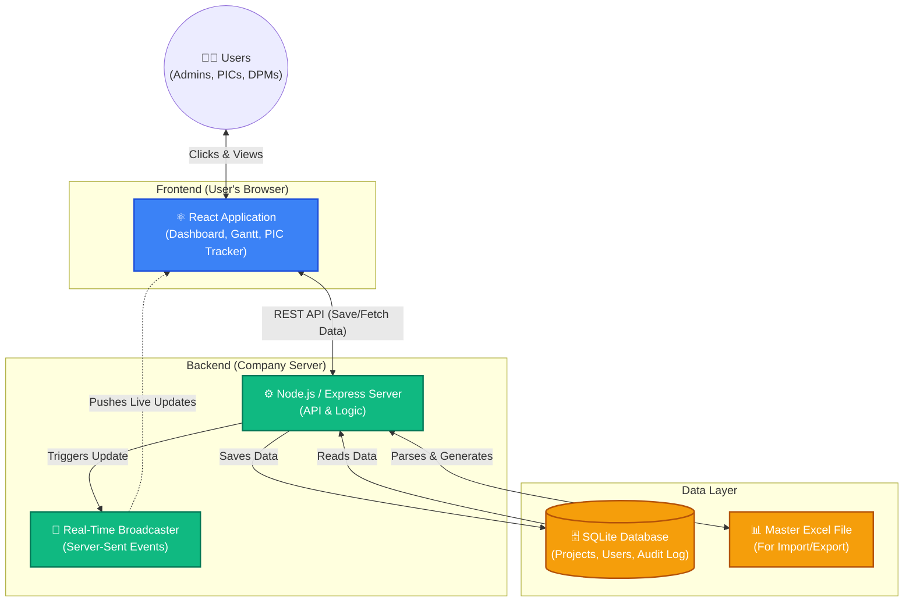

# Technical Specifications & Developer Guide: PMO Dashboard

## 1. System Overview
The PMO Dashboard is a complete web application built specifically for the Maruti Suzuki QA Vertical. It tracks projects from their initial idea all the way to completion. The primary goal is to **replace manual Excel tracking** with an automated, real-time dashboard where everyone (Admins, DPMs, and PICs) can see the exact same data instantly.

---

## 2. Architecture Diagram
The application uses a modern "Client-Server" architecture.



---

## 3. Codebase Structure & Directory Mapping

The project is split into two primary folders: `react-app/` (Frontend) and `server/` (Backend).

### 3.1 Frontend (`/react-app`)
This is a React 18 application built using Vite.

* `src/App.jsx` - The main router. If you want to add a new webpage, you must declare its `<Route>` here.
* `src/index.css` - The global stylesheet. Contains all CSS variables, colors, glassmorphism effects, and layout grids. **(Modify this for any visual theme changes).**
* `src/context/` - Global State Managers:
  * `ProjectContext.jsx` - Automatically fetches `/api/projects` and listens for live SSE updates.
  * `AuthContext.jsx` - Manages user login state, JWT tokens, and Roles (RBAC).
* `src/pages/` - The main screens of the application:
  * `Dashboard.jsx` - The main data table view.
  * `Flagship.jsx` - Similar to the Dashboard but filtered specifically for high-priority projects.
  * `Gantt.jsx` - The visual timeline generator.
  * `HealthCard.jsx` - Generates the Red/Amber/Green statistical summary.
  * `PicStaleness.jsx` - The algorithmic Heatmap that surfaces neglected projects.
* `src/components/` - Reusable UI elements (e.g., `Sidebar.jsx`, `Header.jsx`, `ProjectForm.jsx`).

### 3.2 Backend (`/server`)
This is a Node.js / Express application.

* `server.js` - The entry point. It configures the Express server, mounts the API routes, and establishes the Server-Sent Events (SSE) connection stream.
* `db/schema.js` - **The Database Definition.** If you need to add a new column to the database (e.g., adding a "Budget" column to a project), you must modify the SQL `CREATE TABLE` statements here.
* `routes/` - The API Endpoints:
  * `projects.js` - Handles fetching, updating, and saving projects. Triggers the SSE broadcast when a project changes.
  * `import-export.js` - Parses uploaded Excel files using the `xlsx` library and syncs them with the database.
  * `auth.js` - Handles login validation and JWT generation using `bcryptjs`.
  * `users.js` - CRUD operations for managing employees.

---

## 4. Developer Guide: "How to Make Changes"

If you are a developer taking over this project, here is exactly where you need to go to make common modifications:

### Scenario A: Adding a New Page to the App
1. Create a new React component file in `react-app/src/pages/NewPage.jsx`.
2. Open `react-app/src/App.jsx` and import your new page, then add it to the `<Routes>` list:
   ```jsx
   <Route path="/new-page" element={<ProtectedRoute><NewPage /></ProtectedRoute>} />
   ```
3. Open `react-app/src/components/Sidebar.jsx` and add a new link to the `NAV` array so users can click it.

### Scenario B: Adding a New Field to a Project (e.g., "Budget")
1. **Database:** Open `server/db/schema.js` and add `budget INTEGER` to the `CREATE TABLE IF NOT EXISTS projects` query.
2. **Backend API:** Open `server/routes/projects.js`. In the `router.post('/')` and `router.put('/:id')` endpoints, extract `budget` from `req.body` and add it to your SQL `INSERT` and `UPDATE` statements.
3. **Frontend Form:** Open `react-app/src/components/ProjectForm.jsx`. Add a new `<input>` field for Budget, and map it to `formData.budget`.
4. **Frontend Display:** Open `react-app/src/pages/Dashboard.jsx` and add a "Budget" column to the `<table>` element.

### Scenario C: Changing the Color Scheme or Styling
Everything is controlled by vanilla CSS Variables to keep the app lightweight.
1. Open `react-app/src/index.css`.
2. Locate the `:root` block at the very top of the file.
3. Modify variables like `--primary: #0a429a;` or `--surface: #ffffff;`. The entire application will instantly update its colors.

### Scenario D: Broadcasting Real-Time Updates (SSE)
If you build a new feature (like a live chat or live notifications) and want all users to see it instantly without refreshing:
1. In your backend route (e.g., `routes/notifications.js`), process your logic.
2. Call the broadcast function: `_broadcast('notification_added', newNotificationData);`
3. In your React component, use `useEffect` to listen to the EventSource for `notification_added` and update your React State.
