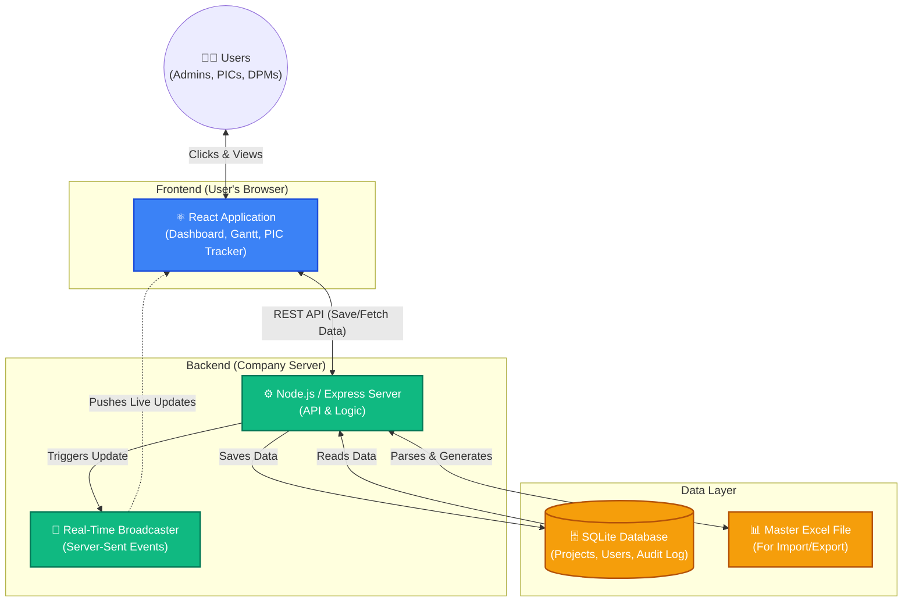

# Technical Specifications: PMO Dashboard & QA Project Monitoring

## 1. System Overview
The PMO Dashboard is a complete web application built specifically for the Maruti Suzuki QA Vertical. It is designed to track projects from their initial idea all the way to completion. 

The main goal of this system is to **replace manual Excel tracking** with an automated, real-time dashboard where everyone (Admins, DPMs, and PICs) can see the exact same data instantly.

---

## 2. Architecture Diagram

The application uses a modern "Client-Server" architecture. Below is a visual representation of how the different parts of the system communicate with each other:

---

## 3. How the Layers Work (Easier to Understand)

### 3.1 The Frontend (What the user sees)
* **Built with React:** The user interface is built using React. This means the page doesn't need to refresh when you click around; it feels as fast and smooth as a desktop app.
* **Offline Ready Packaging:** The frontend is "compiled" via a tool called Vite into a `dist` folder. Because of this, the server doesn't need external internet to run the UI—everything is bundled locally.

### 3.2 The Backend (The brain of the system)
* **Node.js & Express:** This is the server program that listens for requests (like "Save this project" or "Add this user").
* **Live Updates (SSE):** Instead of forcing the user to press the refresh button, the server uses a technology called **Server-Sent Events (SSE)**. If one PIC saves a project, the server instantly beams that update to every other manager's screen in less than a second.

### 3.3 The Database (Where data lives)
* **SQLite:** A lightweight, highly reliable database that lives in a single file (`pmo_data.db`). 
* **WAL Mode:** We configured the database to use "Write-Ahead Logging". In simple terms, this prevents traffic jams. It allows multiple PICs to read and write to the dashboard at the exact same time without crashing or locking the file.

---

## 4. Key Features & How They Are Built

1. **Dashboard & Flagship Views:** Uses intelligent React filtering to instantly sort hundreds of projects without slowing down the computer.
2. **Gantt Chart Timeline:** The system automatically reads the `start_date` and `end_date` of a project, does math in the background, and draws visual progress bars for the schedule.
3. **PIC Staleness Heatmap:** The server secretly records the `updated_at` time every time a project is saved. The PIC Tracker page simply calculates the days between "Today" and that saved date, turning the row Red if it has been neglected for too long.
4. **Excel Import/Export:** Uses the `xlsx` library to read uploaded Excel spreadsheets, automatically translating the rows into Database entries.

---

## 5. Security & Privacy
* **Role-Based Access (RBAC):** The system knows who is logged in. A regular PIC cannot delete users or change other people's passwords, whereas an Admin has full control.
* **Encrypted Passwords:** Passwords are not saved as plain text. They are scrambled using a cryptographic algorithm called `bcryptjs`. Even if someone steals the database file, they cannot read the passwords.
* **Audit Logging:** Every single edit is permanently recorded in the database. The system tracks *Who* made the change, *When*, and exactly *What* value was modified.
